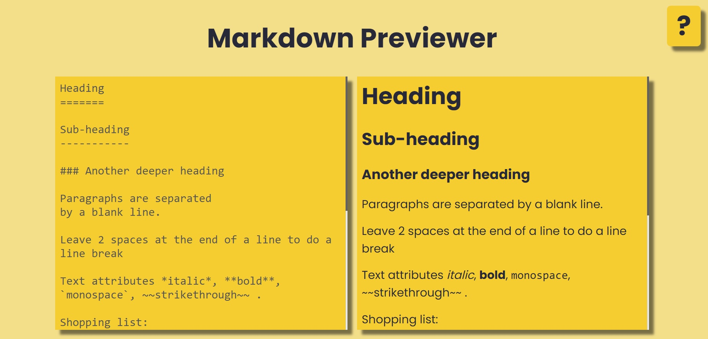

# Getting Started with Create React App

This project was bootstrapped with [Create React App](https://github.com/facebook/create-react-app) using the [React Markdown](https://www.npmjs.com/package/react-markdown), [React Syntax Highlighter](https://www.npmjs.com/package/react-syntax-highlighter), [Redux](https://redux.js.org/) and [Redux Toolkit](https://redux-toolkit.js.org/) template.

## Live
[Link](https://markdown-previewer-murex.vercel.app)

## Photo

## Available Scripts

In the project directory, you can run:

### `yarn start`

Runs the app in the development mode.\
Open [http://localhost:3000](http://localhost:3000) to view it in the browser.

The page will reload if you make edits.\
You will also see any lint errors in the console.
